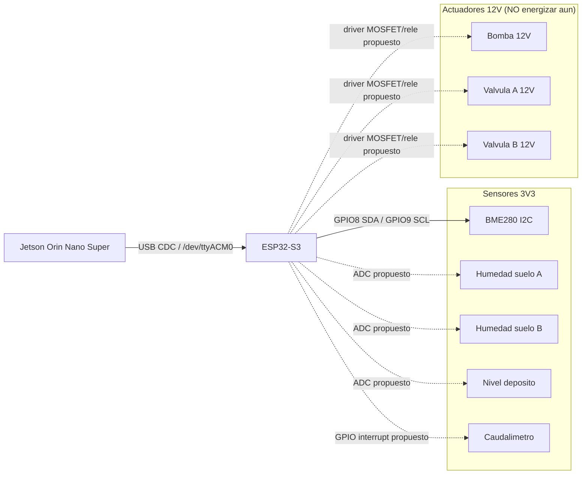
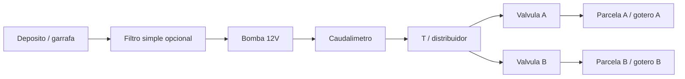

# Dia 19 - Esquemas de montaje Rhizome fisico

**Objetivo:** permitir que Bea empiece el montaje fisico de agua, sensores,
alimentacion y cableado sin saltarse la frontera de seguridad.

**Estado de firmware al arrancar dia 19:** el firmware soporta USB-CDC,
`STATUS`, `HOST_HEARTBEAT`, `TELEMETRY`, `WATER` en `DRY_RUN`, safety rules y
BME280 por I2C (`GPIO8/9`). Los pines de sensores analogicos, caudalimetro y
actuadores todavia son **propuesta de montaje**, no contrato de firmware.

## 0. Reglas de seguridad antes de tocar cables

- No conectar bomba ni valvulas a 12V hasta completar inspeccion visual y
  prueba de continuidad.
- Nunca alimentar bomba/valvulas desde el ESP32.
- Mantener fuente Jetson, fuente 12V actuadores y 5V/USB ESP32 como dominios
  separados, con **GND comun solo en el punto de control**.
- Todo positivo de 12V hacia bomba/valvulas pasa por fusible.
- Toda carga inductiva necesita flyback: diodo en bomba/solenoide o modulo
  driver que lo incluya.
- Si hay agua cerca, alimentar el circuito solo con cables sujetos, sin puntas
  sueltas y con las uniones elevadas o dentro de caja.
- Primero se prueba con multimetro; despues con ESP32 en `DRY_RUN`; solo al
  final se prueba actuador real.

## 1. Arquitectura electrica global



Lectura:

- Lineas solidas: ya implementado/probado.
- Lineas punteadas: se puede preparar mecanicamente y etiquetar, pero no
  conectar como funcional hasta firmware/pinout confirmado.

## 2. Alimentacion y masas

```text
        [Fuente Jetson dedicada]
                 |
              Jetson
                 |
           USB-C/USB data
                 |
              ESP32

        [Fuente 12V actuadores]
          +12V ---- Fusible ----+---- Bomba +
                                +---- Valvula A +
                                +---- Valvula B +

          GND ------------------+---- Bomba/valvulas -
                                |
                                +---- GND driver
                                |
                                +---- GND ESP32 (masa comun)
```

Recomendacion de fuentes:

| Dominio | Fuente recomendada | Comentario |
|---|---|---|
| Jetson | Fuente dedicada oficial/estable | No compartir con bomba. |
| ESP32 | USB desde Jetson o 5V estable | Para MVP, USB es correcto y simplifica serie. |
| Actuadores | 12V DC, corriente >= bomba + valvulas + 50% margen | Si la bomba no indica consumo, empezar con 12V 3A como minimo razonable. |
| Buck 5V opcional | 12V->5V 2A | Solo si se quiere alimentar ESP32 fuera de USB. No necesario para primer montaje. |

Fusible:

- Poner fusible en el positivo de 12V antes de ramificar a actuadores.
- Valor inicial orientativo: algo por encima de la corriente nominal de la
  bomba. Si la bomba no tiene etiqueta, empezar conservador con 2A-3A y ajustar
  tras medir.

## 3. Bus I2C BME280 autorizado hoy

Cableado validado:

| ESP32-S3 | BME280 WPSE335 | Nota |
|---|---|---|
| `3V3` | `VCC` | No usar 5V salvo modulo explicitamente tolerante. |
| `GND` | `GND` | Masa comun sensor/control. |
| `GPIO8` | `SDA` | I2C data. |
| `GPIO9` | `SCL` | I2C clock. |
| `3V3` | `CSB` | Fuerza modo I2C. |
| `GND` | `SDO` | Direccion `0x76`. |

Prueba esperada:

```text
I2C_SCAN count=1 addrs=0x76
BME280_PROBE status=CONNECTED address=0x76 chip_id=0x60
BME280_REPORT status=CONNECTED ... error=ESP_OK sensor_rslt=0
```

## 3.1 Pines que NO se usan

En el perfil `n16r8_usb_otg`:

| GPIO | Motivo |
|---:|---|
| `GPIO19` / `GPIO20` | USB nativo. |
| `GPIO35` / `GPIO36` / `GPIO37` | PSRAM Octal. |
| `GPIO45` / `GPIO46` | strapping/arranque sensible. |

En `devkitc_n8r8`, evitar tambien `GPIO48` al principio.

Regla de montaje: si un cable no esta en tabla como `activo` o `candidato`, no
se conecta al ESP32. Se etiqueta y se deja en bornera.

## 4. Sensores analogicos - montaje fisico preparado

Sensores:

- humedad suelo A
- humedad suelo B
- nivel deposito

Decision dia 19:

- Montar fisicamente sensores y llevar cables a bornera/caja.
- Etiquetar `SOIL_A_SIG`, `SOIL_B_SIG`, `TANK_SIG`, `3V3`, `GND`.
- No soldar/cerrar pinout final hasta PR de firmware de entradas analogicas.

Pinout propuesto para firmware siguiente, pendiente de validar:

| Senal | GPIO candidato | Motivo |
|---|---:|---|
| `SOIL_A_SIG` | `GPIO1` | ADC, no reservado en spec actual. |
| `SOIL_B_SIG` | `GPIO2` | ADC, no reservado en spec actual. |
| `TANK_SIG` | `GPIO4` | ADC, evita GPIO3 por strapping. |

Notas:

- Confirmar que cada salida analogica nunca supera `3.3V`.
- Si algun modulo entrega 5V en `AO`, usar divisor resistivo o ADS1115/level
  adaptation antes de ESP32.
- Para MVP rapido se puede usar ADC interno; para lectura mas estable, la spec
  recomienda ADS1115 por I2C.

## 5. Caudalimetro - montaje preparado

Cableado habitual de caudalimetro Hall:

| Cable caudalimetro | Conexion propuesta | Nota |
|---|---|---|
| Rojo | `5V` o tension indicada por modulo | Ver etiqueta/modelo antes. |
| Negro | `GND` comun | Comun con ESP32. |
| Amarillo/senal | GPIO interrupt propuesto | Requiere pull-up adecuado a 3V3. |

GPIO candidato:

| Senal | GPIO candidato | Estado |
|---|---:|---|
| `FLOW_PULSE` | `GPIO15` | Pendiente firmware. |

Regla:

- La senal que entra al ESP32 debe ser 3.3V maxima.
- Si el caudalimetro se alimenta a 5V y la salida sube a 5V, usar pull-up a
  3V3 o adaptador de nivel. No conectar salida 5V directa al ESP32.

## 6. Actuadores 12V - esquema recomendado, NO activar aun

Opcion preferida para bomba/valvulas DC: driver MOSFET low-side por actuador.

```text
             +12V protegido por fusible
                    |
                    +------ Bomba +
                           Bomba -
                              |
                              +------ Drain MOSFET N logic-level
                                      Source -> GND 12V/control comun
                                      Gate   -> GPIO ESP32 via 100-220 ohm
                                      Gate   -> GND via 100k pulldown

             Diodo flyback en paralelo con bomba:
             catodo a +12V, anodo al lado MOSFET/bomba -
```

Repetir el mismo patron para:

- bomba
- valvula A
- valvula B

GPIOs candidatos, pendientes de firmware:

| Actuador | GPIO candidato | Estado |
|---|---:|---|
| Bomba | `GPIO16` | Pendiente firmware y prueba sin carga. |
| Valvula A | `GPIO17` | Pendiente firmware y prueba sin carga. |
| Valvula B | `GPIO18` | Pendiente firmware y prueba sin carga. |

Si se usa modulo de reles:

- Confirmar que la entrada acepta logica `3.3V`.
- Confirmar si el modulo ya incluye diodo/optoacoplador/transistor.
- Aun con rele, bomba/valvula debe tener proteccion contra picos si el modulo
  no la integra.
- No usar rele desnudo directo al GPIO del ESP32.

## 7. Esquema hidraulico



Orden fisico recomendado:

1. Deposito.
2. Filtro opcional antes de bomba si hay particulas.
3. Bomba.
4. Caudalimetro despues de bomba, antes de dividir parcelas.
5. T/distribuidor.
6. Valvula A y valvula B.
7. Tubo/gotero hacia cada parcela.

Notas:

- Si solo hay una bomba y no hay valvulas todavia, montar hidraulica con salida
  unica y dejar derivaciones A/B tapadas/etiquetadas.
- Evitar que agua pueda caer por gravedad sobre electronica.
- Caja electronica por encima del nivel de agua y con pasamuros/prensaestopas.

## 8. Borneras y etiquetado

Etiquetas minimas:

| Etiqueta | Tipo | Estado dia 19 |
|---|---|---|
| `ESP32_USB` | datos/alimentacion | activo |
| `I2C_SDA_GPIO8` | sensor | activo |
| `I2C_SCL_GPIO9` | sensor | activo |
| `BME280_3V3` | sensor | activo |
| `BME280_GND` | sensor | activo |
| `SOIL_A_SIG` | analogico | preparar |
| `SOIL_B_SIG` | analogico | preparar |
| `TANK_SIG` | analogico | preparar |
| `FLOW_PULSE` | pulso | preparar |
| `PUMP_GATE` | actuador | preparar, no conectar a GPIO aun |
| `VALVE_A_GATE` | actuador | preparar, no conectar a GPIO aun |
| `VALVE_B_GATE` | actuador | preparar, no conectar a GPIO aun |
| `12V_IN_FUSED` | potencia | preparar sin energizar |
| `GND_COMMON` | masa | preparar y verificar |

## 9. Orden de montaje recomendado

### Fase A - permitido hoy

1. Montar ESP32 en protoboard/caja sin 12V.
2. Conectar BME280 validado.
3. Conectar ESP32 por USB a Jetson.
4. Ejecutar `STATUS`, `I2C_SCAN`, `BME280_PROBE`, `BME280_READ`.
5. Montar mecanicamente deposito, tubos, bomba, caudalimetro y valvulas sin
   energizar.
6. Etiquetar cables de sensores analogicos/caudal/actuadores.

### Fase B - preparar sin energizar

1. Instalar portafusible en positivo de 12V.
2. Preparar bornera `12V_IN_FUSED` y `GND_COMMON`.
3. Montar driver MOSFET/rele sin conectar GPIO.
4. Verificar con multimetro continuidad y ausencia de corto entre `12V` y
   `GND`.

### Fase C - requiere PR de firmware y validacion

1. Confirmar pinout analogico/caudal/actuadores en firmware.
2. Probar cada GPIO con LED/resistencia o multimetro, sin bomba.
3. Probar bomba con carga simulada o breve pulso controlado.
4. Probar caudalimetro con agua real, sin riego automatico.
5. Solo entonces habilitar flujo `WATER` fuera de `DRY_RUN`.

## 10. Checklist pre-energia 12V

Antes de conectar fuente de 12V:

- [ ] Fusible instalado en positivo.
- [ ] Polaridad fuente verificada.
- [ ] `GND` 12V y `GND` ESP32 unidos en punto controlado.
- [ ] No hay continuidad directa entre `+12V` y `GND`.
- [ ] Diodo flyback instalado o modulo driver con proteccion confirmada.
- [ ] GPIO de actuador tiene pulldown.
- [ ] Bomba/valvulas no estan cerca de cable USB/Jetson.
- [ ] Agua no puede gotear sobre protoboard/ESP32/Jetson.
- [ ] Prueba `STATUS` sigue en `SAFE_IDLE`.
- [ ] Prueba `WATER A 12` sigue rechazando cuando `tank_level_pct < 20`.

## 11. Pendientes para firmware

- Implementar lectura real `SOIL_A`, `SOIL_B`, `TANK_LEVEL`.
- Implementar contador real `FLOW_PULSE`.
- Implementar salidas reales bomba/valvulas con modo seguro por defecto.
- Mantener `DRY_RUN` como modo de rehearsal hasta que Bea/Xilema lo desactiven
  explicitamente.
